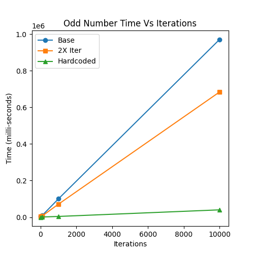

# Odd Numbers

This project quickly evolved into running timing tests for creating a list of odd numbers and reversed list.

## Base
This function utilizes logic to find the odd numbers in a loop from 0 to max

## 2X Iter
This function uses a range the increments by 2 starting at 1, skipping the logic.

## Hardcoded
This function hardcodes the tuple and is timed while copying the tuples to a list.

## Summary
The results are to be expected for basic optimization. This project served as a proof of concept for testing python functions.
